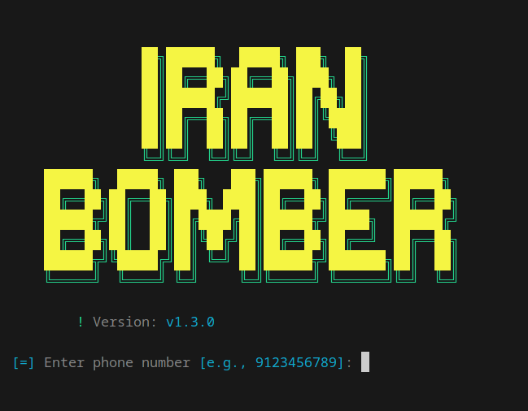

<div align="center">
  <h1>💀 ایران بمبر</h1>
  <p>نسخه سریع و کراس‌پلتفرم SMS Bomber ایرانی با Go</p>
  
</div>

---

## 🔥 معرفی

**ایران بمبر** یک ابزار قدرتمند برای ارسال پیامک است که قبلاً با **Python** نوشته شده بود و اکنون با **Go** بازنویسی شده است.  
مزایا:

- **سرعت بسیار بالا** با استفاده از `fasthttp` و Go
- **کراس‌پلتفرم**: اجرا روی Windows، Linux، macOS و حتی **Android** با **Termux**
- **پویا و مقیاس‌پذیر**: وجود `api.json` که به‌صورت داینامیک لود می‌شود
- **بیلد با گیتهاب اکشنز**: اطمینان از تطابق داشتن فایل های اجرایی با سورس کد
- امکان استفاده از `api.json` اختصاصی با فلگ `-api`
- امکان گسترش به نسخه وب به راحتی
- استفاده و نصب راحت و آسان
---

## ⚙️ نصب و استفاده ساده

### Windows
- فایل **exe پورتابل** را از [Releases](https://github.com/M-logique/iran-bomber/releases/latest) دانلود کنید و **همین‌طوری اجرا کنید**.

### Linux / macOS / Termux
```bash
bash <(curl -s https://raw.githubusercontent.com/M-logique/iran-bomber/master/install.sh)
````

### Go Install

```bash
go install github.com/M-logique/iran-bomber@latest
```

> مطمئن شوید که `$GOPATH/bin` در PATH شماست.

---

## 📝 استفاده

* ساده‌ترین روش: **فایل را اجرا کنید**

```bash
./iran-bomber
```

* یا استفاده با فلگ‌ها:

```bash
./iran-bomber -phone 9123456789 -c 200 -loop 5
```

فلگ‌ها:

```text
  -api string        مسیر به API JSON یا URL
  -c int             تعداد درخواست‌های همزمان (پیش‌فرض 100)
  -loop int          تعداد دفعات تکرار (پیش‌فرض 1)
  -phone string      شماره هدف
  -proxy-file string مسیر فایل پروکسی
  -proxy-url string  URL لیست پروکسی
  -url string        فیلتر کردن APIها بر اساس URL
```

* استفاده از پروکسی‌ها:

```bash
./iran-bomber -phone 9123456789 -proxy-file proxies.txt
```

---

## 💡 نکات

* `api.json` همیشه به‌روز نگه داشته می‌شود و می‌توانید API اختصاصی خود را با فلگ `-api` جایگزین کنید.
* به دلیل Go و Fasthttp، **خیلی سریع و پایدار** است.
* با مقیاس‌پذیری بالا، امکان ایجاد نسخه وب یا سرویس خودکار وجود دارد.

---

## 📜 مجوز

این پروژه تحت مجوز **MIT** منتشر شده است.

<div align="center">
  ساخته شده با ❤️ و بدون قهوه توسط <a href="https://github.com/M-logique">M-logique</a>
</div>